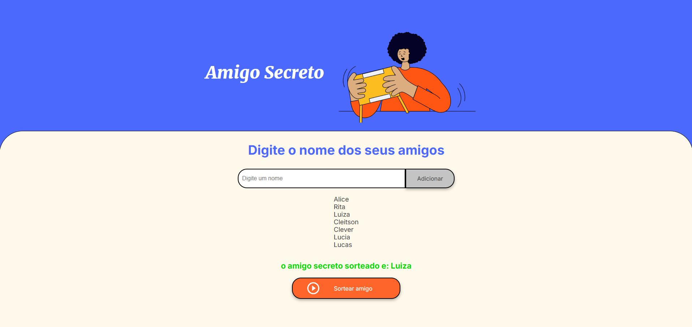

# Amigo Secreto

Este é um projeto para organizar um jogo de Amigo Secreto, desenvolvido como parte do desafio Oracle One.

## Descrição

O Amigo Secreto é um jogo popular em que os participantes trocam presentes de forma anônima. Este projeto visa facilitar a organização do jogo, permitindo que os participantes sejam sorteados automaticamente e recebam notificações sobre quem é seu amigo secreto.

## Funcionalidades

- Cadastro de participantes
- Sorteio automático dos amigos secretos

## Imagem do projeto 



## Tecnologias Utilizadas

- HTML
- CSS
- JavaScript

## Como Executar o Projeto

1. Clone o repositório:
  ```bash
  git clone https://github.com/cleitson/challenge-amigo-secreto_OracleOne.git
  ```
2. Navegue até o diretório do projeto:
  ```bash
  cd challenge-amigo-secreto_OracleOne
  ```
3. Abrir pagina web
  ```bash
  Basta abrir o index.html
  ```


## Contribuição

Contribuições são bem-vindas! Sinta-se à vontade para abrir issues e enviar pull requests.

## Contato

- LinkedIn: [Cleitson Lima](https://www.linkedin.com/in/cleitsonlima/)
- Portfólio: [cleitson.dev.br](https://cleitson.dev.br/)
- E-mail: cleitson.ftw@gmail.com
